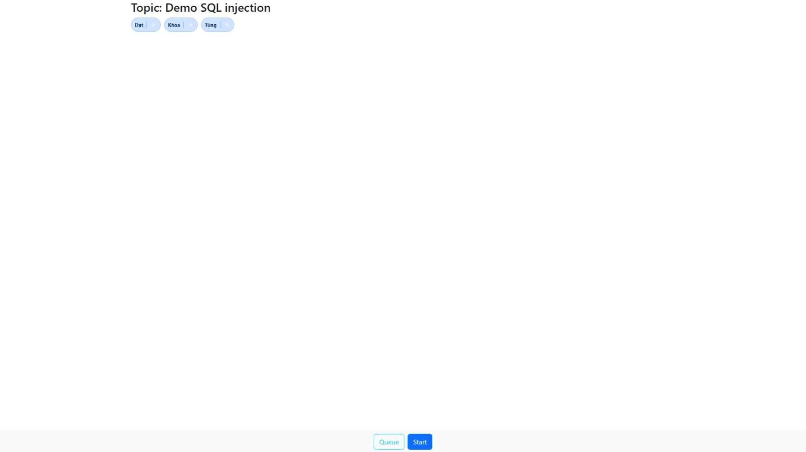
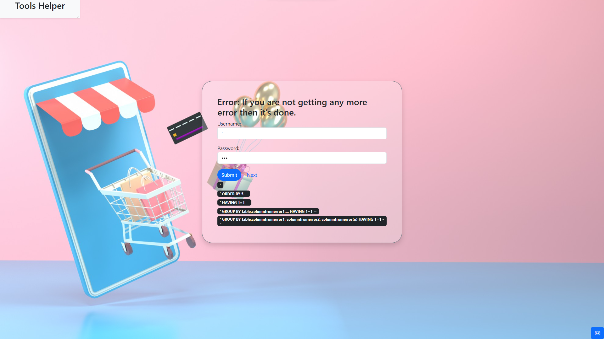
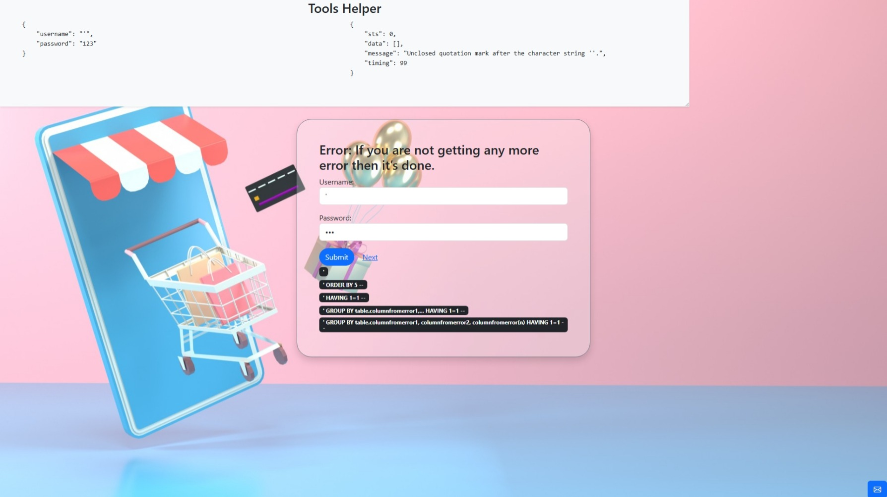
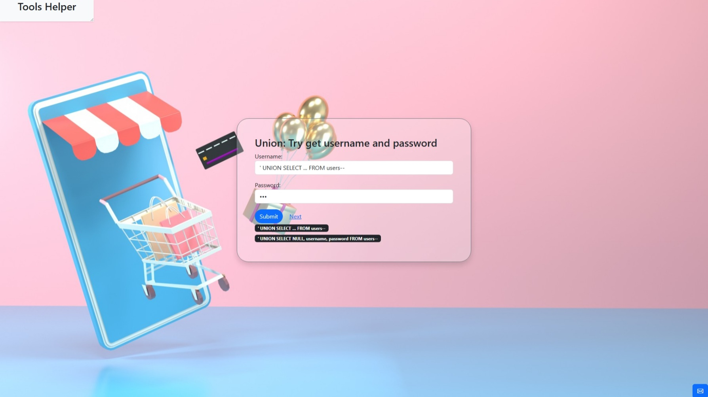
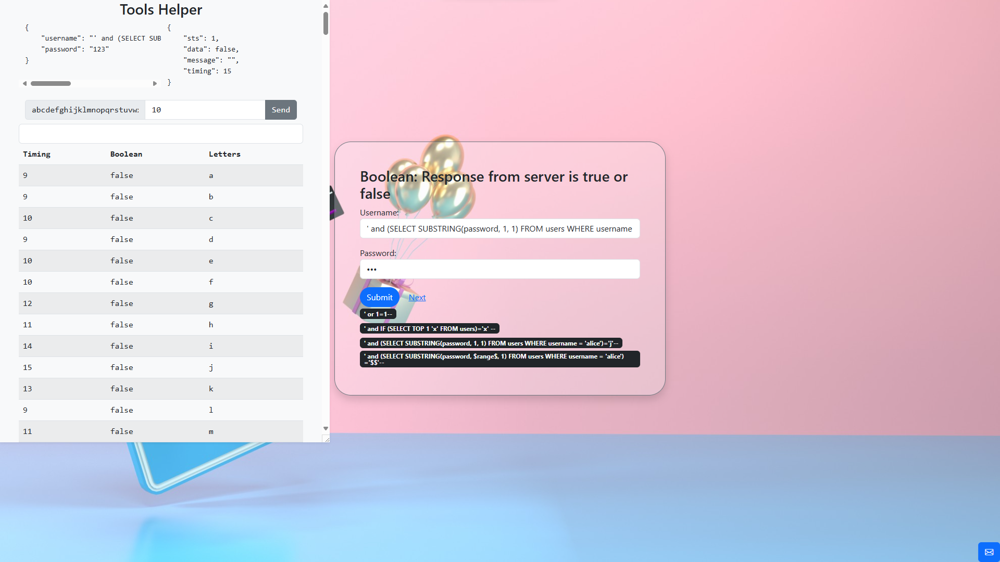
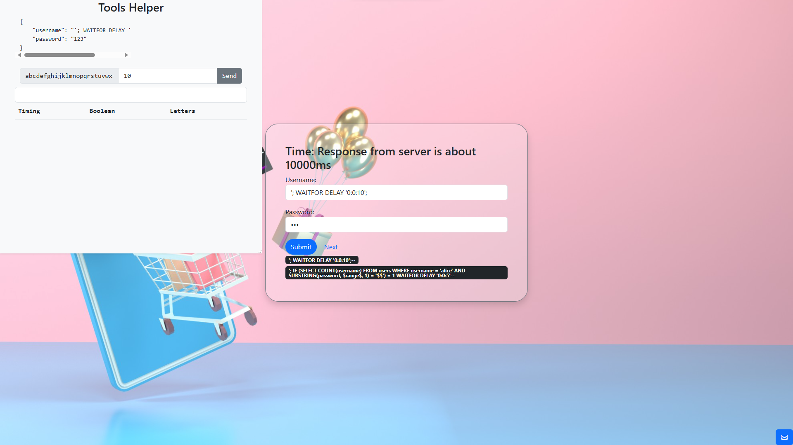
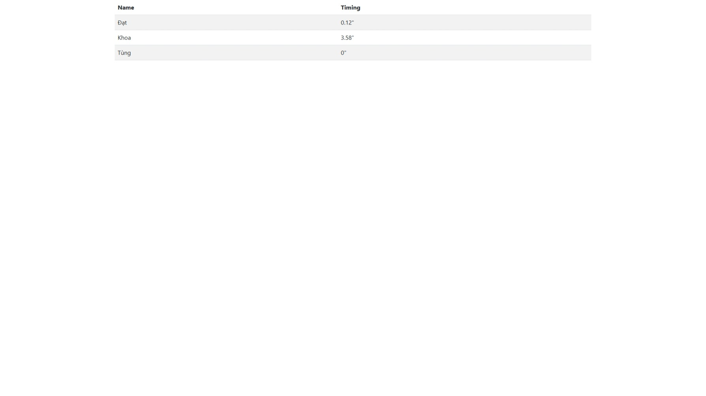

# mini-game-sql-injection
This project is a simple game that was made for a database course, helping us understand how SQL injection works.

---

# Description
The project has 3 rounds. In each round, the player can explore SQL commands, helping them explore the data stored in the database.

---
# Tech stack
- Express.JS
- SQL Server
- Bootstrap
- HTML, CSS, Javascript
- Websocket
---

# Image

The player must sign their name to play.

After that, the player will be in the queue, waiting for other players to join the game.

This is a simple control panel where the game master can start the game and see how many players are in this game.

Round 1: Starter

Round 1: The helper tools above will show us what happened.

Round 2: Database insight

Round 3: Try advanced commands

Round 3: Try advanced commands

Scoreboard: A list of the players who solved all tasks quickly.
